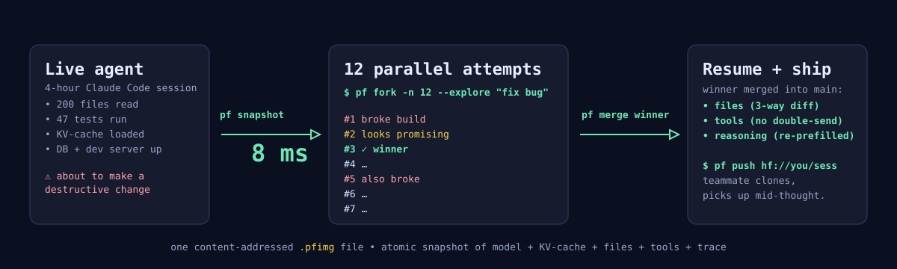
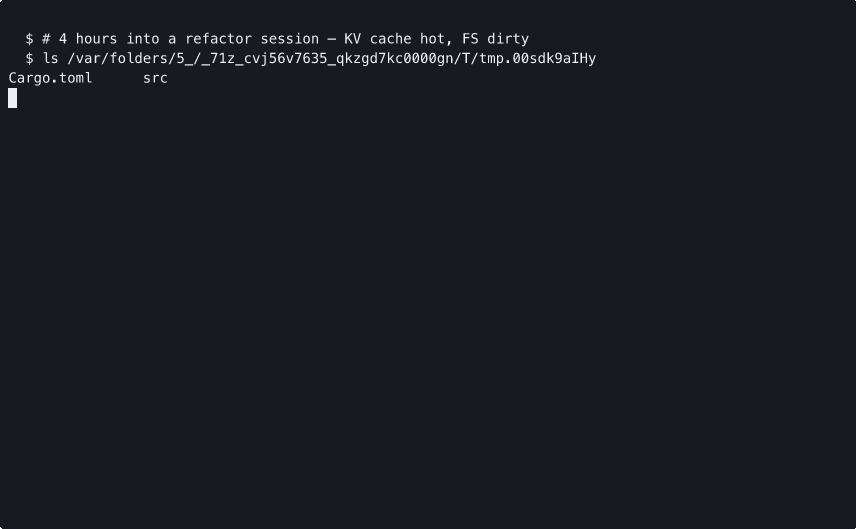

<h1 align="center">ProcessFork</h1>
<p align="center"><b><code>git</code> for AI agents.</b> Snapshot, fork, and merge live LLM sessions in <b>8&nbsp;ms</b>.</p>

<p align="center">
  
</p>

<p align="center">
  <a href="./demo/processfork-demo.cast">
    
  </a>
  <br>
  <sub>↑ <a href="./demo/processfork-demo.cast">Replay it locally</a>: <code>asciinema play demo/processfork-demo.cast</code></sub>
</p>

<p align="center">
  <a href="https://crates.io/crates/processfork"></a>
  <a href="https://pypi.org/project/processfork/"></a>
  <a href="https://www.npmjs.com/package/@processfork/sdk"></a>
  <a href="https://github.com/manav8498/processfork/releases/latest"></a>
  <a href="https://github.com/manav8498/processfork/blob/main/LICENSE"></a>
</p>
<p align="center">
  <a href="https://github.com/manav8498/processfork/actions"></a>
  <a href="#status"></a>
  <a href="#status"></a>
  <a href="./coverage/README.md"></a>
  <a href="#install"></a>
</p>

---

## Why

You're 4 hours into a refactor with Claude Code. The agent has read 200 files, run 47 tests, opened a database, started a dev server. Then it suggests a destructive change.

**Today**: lose everything, undo by hand, or restart.
**With ProcessFork**: `pf snapshot` → 8 ms → safe. Try 12 alternatives in parallel, merge the winner back, ship the whole session to a teammate.

It's `git` — snapshot, branch, merge, push, clone — but for live AI agent state.

## Highlights

- ⚡ **8 ms snapshots.** Full agent state — model + KV-cache + files + tools + reasoning — into one content-addressed `.pfimg`.
- 🌳 **Real fork & merge.** 12 parallel attempts share storage automatically (CoW). Merge the winner with a real 3-way diff (files, tools, trace) — git-style `<<<<<<<` markers and all.
- 🔒 **Won't double-send your email.** HMAC-chained tool-call ledger; restored agents see prior side-effects as facts, not as actions to re-issue. (ACRFence-resistant.)
- 🤝 **Drop-in for** Claude Code, LangGraph, OpenInterpreter, vLLM, SGLang, AutoGen, CrewAI.
- 📦 **Single binary**, MIT, Rust core, Python + TypeScript SDKs. **200+ tests.**

## Quick start (60 seconds)

```bash
# install the CLI:
cargo install processfork                      # → `pf` on your $PATH

# snapshot a directory:
mkdir /tmp/sandbox && echo "fn main() {}" > /tmp/sandbox/main.rs
pf snapshot --agent-id demo --fs-root /tmp/sandbox
# → sha256:1c2497b0…   ⏱ 8 ms

# edit something, snapshot again, see the diff:
echo "fn main() { println!(\"hi\") }" > /tmp/sandbox/main.rs
pf snapshot --agent-id demo --fs-root /tmp/sandbox --name v2
pf log
pf diff <first-cid> <second-cid>
```

Prefer Python? `pip install processfork`. TypeScript? `npm install @processfork/sdk`.

The **full 60-second demo** (snapshot → fork ×12 → merge → push → clone on a fresh store) is `bash demo/script.sh`. Runs end-to-end on a laptop. No GPU, no API keys.

## When you'd reach for it

| Situation                                            | Command                                  |
|------------------------------------------------------|------------------------------------------|
| Agent about to do something destructive              | `pf snapshot pre-rm-rf`                  |
| Stuck — want to try 12 approaches in parallel        | `pf fork -n 12 --explore "fix bug"`      |
| Hand a complex session to a teammate                 | `pf push hf://you/session-name`          |
| Time-travel debug ("when did it go wrong?")          | `pf log` then `pf checkout <CID>`        |
| RL rollout fabric for agent training                 | snapshot, fan out, score, merge          |

## Use it with your stack

| Adapter | Status | What it gives you |
|---------|--------|-------------------|
| [Claude Code](./adapters/pf-claude-code/)         | ✅ ships now | `/snapshot`, `/fork`, `/merge` slash-commands inside any session |
| [LangGraph](./adapters/pf-langgraph/)             | ✅ ships now | drop-in `BaseCheckpointSaver` (full 4-layer, not just state dict) |
| [OpenInterpreter](./adapters/pf-openinterpreter/) | ✅ ships now | `interpreter.snapshot("pre-rm-rf")` then `.checkout("pre-rm-rf")` |
| [AutoGen](./adapters/pf-autogen/)                 | ✅ ships now | atomic snapshot across a whole agent group's state |
| [CrewAI](./adapters/pf-crewai/)                   | ✅ ships now | `CrewMemory` drop-in; every step time-travelable |
| [vLLM](./adapters/pf-vllm/)                       | ✅ ships now | bit-exact KV-cache snapshot/restore (V0 + V1 engine via collective_rpc) |
| [SGLang](./adapters/pf-sglang/)                   | ✅ ships now | live RadixCache `k_buffer`/`v_buffer` capture, mock-mode parity tests |

## How it works

ProcessFork captures the **five things** that together make up a live agent — atomically — into one content-addressed file:

| Layer       | What it captures                                                |
|-------------|-----------------------------------------------------------------|
| **Model**   | LoRA / IA³ / full-finetune weight diffs, in-place TTT updates   |
| **Cache**   | Paged KV-cache, content-addressed per page (CoW across forks)   |
| **World**   | Filesystem, env, in-flight subprocesses, browser DOM            |
| **Effects** | Append-only ledger of irreversible tool calls (HMAC-chained)    |
| **Trace**   | Chat + tool-call message log                                    |

Identical content shares storage automatically — 12 parallel forks use **~1.5×** the space of one, not 12×. The merge engine handles each layer with the right algorithm: git-style 3-way diff for files, TIES + DARE for model weights, an HMAC chain that defends against semantic-rollback attacks (ACRFence), and an LLM-summarized "what branch B learned" patch injected into branch A's reasoning trace without re-prefilling the cache.

→ **[Architecture deep-dive](./docs/src/architecture.md)** · **[Three-way merge protocol](./docs/src/merge.md)** · **[Engineering specs](./agent_docs/)**

## Status

`v1.0.4` tagged. Closes 4 follow-up audit findings: `--trace-from-jsonl` now validates JSON content per line, real snapshot quiescence via `--pause-pid` (SIGSTOP/SIGCONT RAII guard), the 3 adapter recorders (Claude Code / OpenInterpreter / AutoGen) now persist their recorded tool calls into the effects ledger end-to-end (closing the ACRFence claim), and `examples/02` reflects the live HF/file:// registries. v1.0.3 [security advisories](./SECURITY.md) `PF-SA-2026-001` (Zip Slip) and `PF-SA-2026-002` (env-var leakage) remain in force — **operators on v1.0.0–v1.0.2 should still upgrade and rotate any secrets that may have been in their environment at snapshot time**.

| metric                                                 | observed                 | target           |
|--------------------------------------------------------|--------------------------|------------------|
| Snapshot p50, synthetic 4-layer fixture (macOS arm64)  | **7.9 ms**               | < 500 ms p99     |
| Snapshot p50, real GPU host (Modal A10G, 64 × 4 KiB)   | **42 ms** (warm)         | < 500 ms p99     |
| **Bit-exact KV-cache replay**, vLLM 0.6.6 + TinyLlama-1.1B on A10G | **✅ verified** — 38 619 KV pages snapshotted, restored, regenerated text byte-identical | `out_a == out_b` |
| Cache capture, 64 pages                                | 531 µs                   | —                |
| 12-fork ÷ 1-fork storage ratio                         | well < 1.5×              | ≤ 1.5×           |
| Total tests passing                                    | **200**                  | —                |

Synthetic-fixture numbers come from `cargo bench --workspace`. GPU numbers come from `modal run scripts/gpu-validate-modal.py`; raw JSON lives in [`benchmarks/gpu-validation/`](./benchmarks/gpu-validation/) and the breakdown in [`benchmarks/RESULTS.md`](./benchmarks/RESULTS.md). vLLM ≥0.10 (V1 engine, subprocess-worker architecture) is the v1.0.2 milestone — the v1.0.1 adapter targets V0's directly-introspectable `CacheEngine`.

## Install

```bash
cargo install processfork                          # Rust CLI (the `pf` binary)
pip   install processfork                          # Python SDK
npm   install @processfork/sdk                     # TypeScript SDK
```

**Per-adapter packages** (one each on PyPI):

```bash
pip install processfork-claude-code
pip install processfork-langgraph
pip install processfork-openinterpreter
pip install "processfork-vllm[vllm]"               # needs CUDA + vllm ≥ 0.10
pip install "processfork-sglang[sglang]"           # needs CUDA + sglang ≥ 0.5
pip install "processfork-autogen[autogen]"
pip install "processfork-crewai[crewai]"
```

**Build from source** if you want to hack on it:

```bash
git clone https://github.com/manav8498/processfork && cd processfork
cargo build --release -p processfork               # → target/release/pf
```

Full build-from-source instructions in **[docs/install.md](./docs/src/install.md)**. Pre-built wheels cover **macOS arm64**, **Linux x86_64**, and **Linux aarch64**; macOS Intel + Windows wheels arrive in v1.0.1 (operator: same package, just more platforms).

## Repo layout

```
crates/      Rust workspace (10 crates: pf-core, pf-cache, pf-world, pf-effects,
             pf-model, pf-merge, pf-registry, processfork (CLI, the `pf` binary), pf-py, pf-ts)
adapters/    7 first-party integration packages
benchmarks/  PFBench harness + Criterion microbench
docs/        mdBook source (25+ pages)
examples/    8 self-contained runnable examples
demo/        60-second demo recording script
```

## Docs

[Your first fork (5 min)](./docs/src/first-fork.md) · [60-second demo](./docs/src/demo.md) · [Architecture](./docs/src/architecture.md) · [Merge protocol](./docs/src/merge.md) · [Security model](./SECURITY.md) · [Performance tuning](./docs/src/tuning.md) · [Engineering specs](./agent_docs/)

## Contributing

PRs welcome. The bar is `cargo fmt`, `cargo clippy --all-targets -- -D warnings`, `cargo test --workspace`, plus a green coverage delta. See [CONTRIBUTING.md](./CONTRIBUTING.md).

## License

[MIT](./LICENSE).
