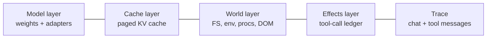
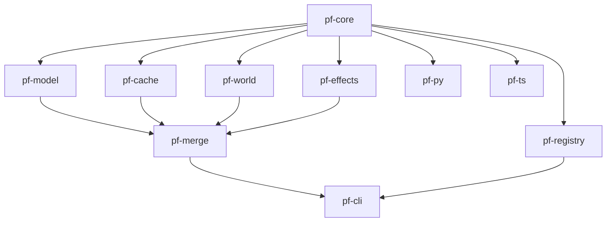

# Architecture

The canonical architecture spec for ProcessFork. **Source of truth** — when
code, docs, or other agent_docs disagree with this file, this file wins
(modulo concerns escalated to `claude-progress.json/architecture_concerns[]`).

## 1. The four-layer model

An "agent" at runtime is the simultaneous, mutating state of:



ProcessFork captures all five (the four layers + the trace) atomically into a
single content-addressed `.pfimg`. Every layer is independently:

- **Content-addressed** (SHA-256, OCI-style `sha256:<hex>`).
- **Compressed** at rest (zstd-19) and lazily decompressed.
- **Copy-on-write** across forks — identical content shares storage.

## 2. Atomic-snapshot orchestration

`pf-core::Snapshotter` runs the four capture pipelines concurrently, each
emitting a CAS digest, then assembles the manifest. Order:

```
                  ┌─→ pf-model::capture()    ─┐
trigger ──fence──┤   pf-cache::capture()    ├─→ assemble Manifest ─→ seal
                  ├─→ pf-world::capture()    ─┤
                  └─→ pf-effects::seal()     ─┘
                                              ↑
                                       trace flushed
```

The fence is a quiesce-token that:

1. Pauses inference (suspends KV-cache writes).
2. Calls `fsync(2)` on world-layer mutable mounts.
3. Stops the effect ledger writer (final entry committed).

The capture pipelines run in parallel and each writes blobs into the CAS
under `${PF_STORE}/blobs/sha256/<aa>/<aabbccdd…>`. Once all four return their
digest, the manifest JSON is written, hashed, and that hash becomes the image
ID. The fence is released.

## 3. The `.pfimg` format

OCI-compatible. Mediatype `application/vnd.processfork.image.v1+json`.

```json
{
  "schemaVersion": 1,
  "mediaType":     "application/vnd.processfork.image.v1+json",
  "agent":   { "kind": "claude-code", "version": "0.4.2", "fingerprint": "…" },
  "model":   { "base": "sha256:…", "diff": "sha256:…" },
  "cache":   { "layout": "paged-batchinvariant-v1", "manifest": "sha256:…" },
  "world":   { "fs": "sha256:…", "env": "sha256:…", "procs": "sha256:…" },
  "effects": { "ledger": "sha256:…" },
  "trace":   { "messages": "sha256:…" },
  "createdAt": "2026-05-05T14:11:00Z",
  "parents": ["sha256:…"]
}
```

Two parents iff the image was produced by a `pf merge`.

## 4. Bit-exact replay substrate

- **Default (near-exact):** deterministic up to ≤1e-4 logit deviation.
- **Opt-in (`pf snapshot --exact`):** full batch-invariant kernels via
  vLLM `--enforce-deterministic` (≥0.10) or SGLang's deterministic mode.
  Throughput cost ~30–60 %; documented in `agent_docs/cache-layer.md`.

## 5. Three-way merge (summary; full spec in `merge-protocol.md`)

| Layer       | Merge primitive                                           |
|-------------|-----------------------------------------------------------|
| Trace       | LLM-summarized "lessons" patch, re-prefilled into target  |
| World       | git-style 3-way file diff with `<<<<<<<` conflict markers |
| Effects     | NEVER replay irreversible; cached as facts (or `--replay-effects`) |
| Model       | TIES + DARE on weight-diff vectors; α=0.5 default         |

## 6. Performance budget (the ship gate)

| Operation                                  | p99 budget |
|--------------------------------------------|------------|
| `pf snapshot` of 380K-token agent on H100  | ≤ 500 ms   |
| `pf fork -n 12` (CoW metadata only)        | ≤ 100 ms   |
| `pf checkout` of 1.2 GB image, cold cache  | ≤ 5 s      |
| Storage 12-fork ÷ storage 1-fork           | ≤ 1.5×     |

## 7. Security model

- All blobs SHA-256 content-addressed.
- Manifests cosign-signed on push.
- Effect ledger entries carry per-session HMAC (defends against semantic-
  rollback per ACRFence, arXiv 2603.20625).
- `pf snapshot --scrub-env <regex>` redacts env-var secrets pre-seal.
- Snapshots **may** contain credentials; documented prominently.

## 8. Crate dependency graph



Hard rule: `pf-core` depends on no other `pf-*` crate. Adapters depend on the
SDK (`pf-py`/`pf-ts`), never directly on the inner crates.
