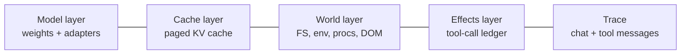
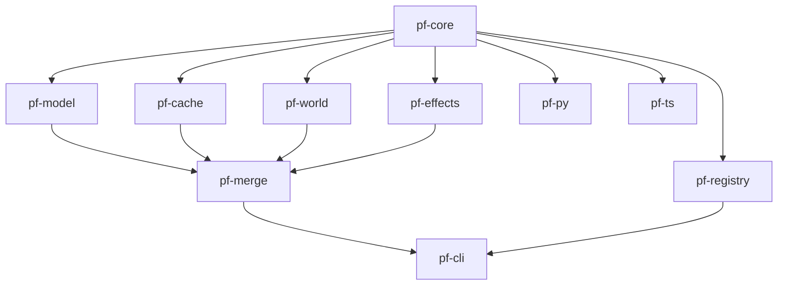

# Architecture overview

> Canonical engineering source: [`agent_docs/architecture.md`](https://github.com/processfork/processfork/blob/main/agent_docs/architecture.md).
> This doc is the user-facing version.

## The four-layer model

An agent at runtime is the simultaneous, mutating state of:



ProcessFork captures all five (the four layers + the trace) atomically
into a single content-addressed `.pfimg`. Every layer is independently:

- **Content-addressed** (SHA-256, OCI-style `sha256:<hex>`).
- **Compressed** at rest (zstd-19) and lazily decompressed.
- **Copy-on-write** across forks — identical content shares storage.

## Atomic snapshot

`pf-core::Snapshotter` runs the four capture pipelines concurrently
on stdlib threads, each emitting a CAS digest, then assembles the
manifest:

```
                  ┌─→ pf-model::capture()    ─┐
trigger ──fence──┤   pf-cache::capture()    ├─→ assemble Manifest ─→ seal
                  ├─→ pf-world::capture()    ─┤
                  └─→ pf-effects::seal()     ─┘
                                              ↑
                                       trace flushed
```

The fence is a quiesce-token that pauses inference, `fsync(2)`s
mutable mounts, and stops the effect-ledger writer (final entry
committed). All five captures run in parallel; once each returns its
digest, the manifest JSON is hashed and that hash becomes the image
ID. The fence is released.

## Crate dependency graph



Hard rule: `pf-core` depends on no other `pf-*` crate. Adapters depend
on the SDKs (`pf-py` / `pf-ts`), never directly on the inner crates.

## What's where

| Crate            | Role                                                  |
|------------------|-------------------------------------------------------|
| `pf-core`        | CAS, `.pfimg` manifest, atomic snapshot orchestrator  |
| `pf-model`       | Weight diffs (LoRA / IA³ / Full / TTT) + TIES + DARE  |
| `pf-cache`       | Paged KV-cache wire format + adapter trait            |
| `pf-world`       | FS / env / processes / DOM capture                    |
| `pf-effects`     | HMAC-chained tool-call ledger + replay policy         |
| `pf-merge`       | Three-way merge engine across all four layers         |
| `pf-registry`    | File / HF / S3 / IPFS / OCI adapters                  |
| `pf-cli`         | The `pf` binary                                       |
| `pf-py`, `pf-ts` | Python (pyo3) and TypeScript (napi-rs) bindings       |
